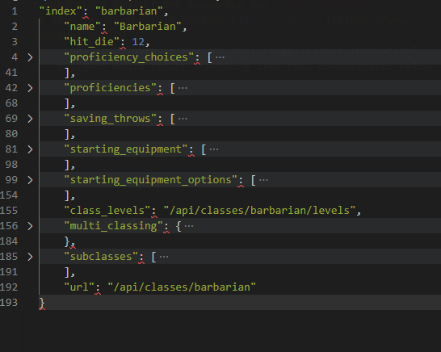
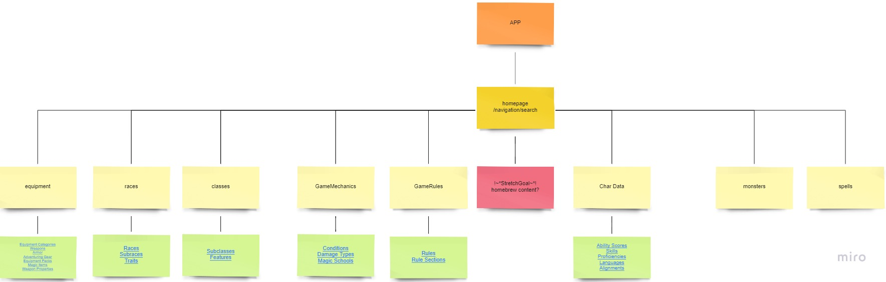
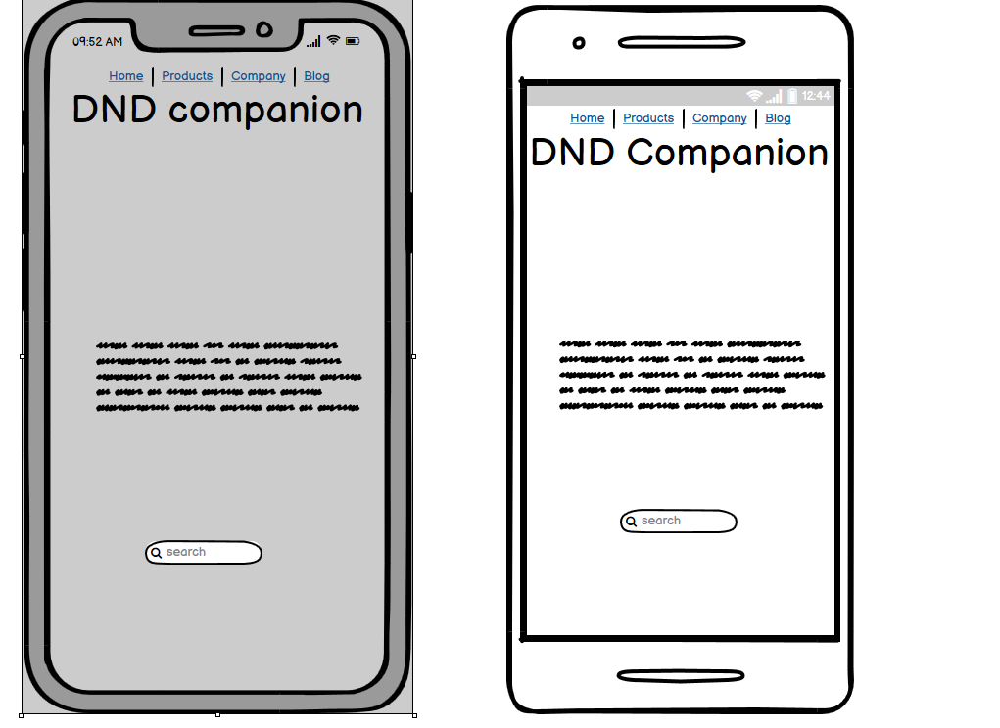
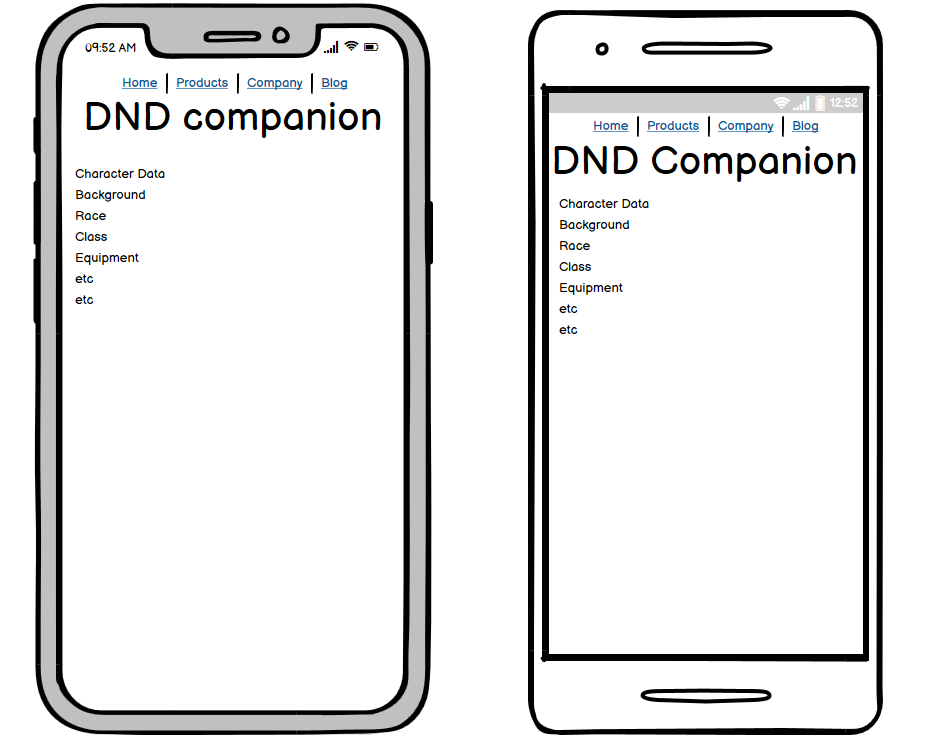
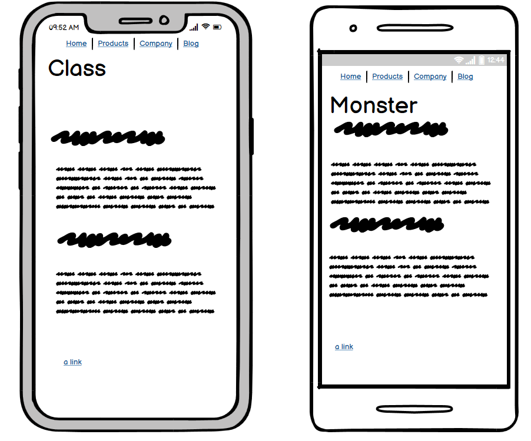
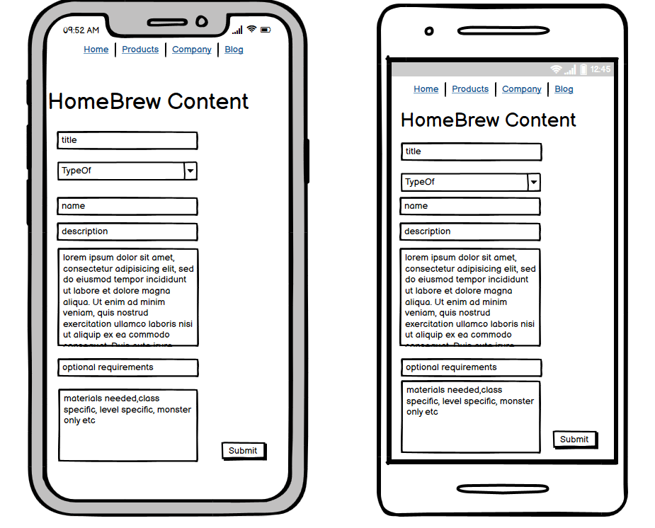

# GAP3 REACT PROJECT DND Companion App  `Name Pending`
## Description: 
my unit 3 app will be 
a pocket companion for dnd players and DM's alike 
it will have a wealth of knowledge 
regarding the dnd multiverse within the 5e rule set.
# MVP Goals
- Rendering atleast 75% of my searchable components aka(Core Game components) from the API
- Search Field to request API data
- Mobile First Design
### Stretch Goals
- Random Die roller/number generator
- Adding Additional Views for non Rendered components
- Mern back end for uploading homebrew content

### Phase2
 - finsh rendering all components and abstract data models
 - add die roller
 - add the back end for user homebrew creation
 - finish style for both mobile and web layouts

# [link to my api](https://www.dnd5eapi.co/) `"dnd5eapi.co"`
- API Resp "https://www.dnd5eapi.co/api/classes/barbarian" 
res.json would return something like this demonstrated below
# [Link to deployed App](http://dungeoneeringguide.surge.sh/) `"Dungeoneering Guide"`

`which would allow me to display a bunch of information such as classes, spells, items, monsters etc`
# Comp Heirachy
[Link to Board](https://miro.com/app/board/uXjVONjQ4Z8=/?invite_link_id=526593467844)

# User Stories
 - As a player I would like a mobile companion App for DND campaigns
 - As DM I would like the ability as a DM to pull up monster stats during gameplay if I don't have my core books
 - As a player I would like the ability to randomly generate a die roll if I happen to leave my dice at home

## WireFrame

